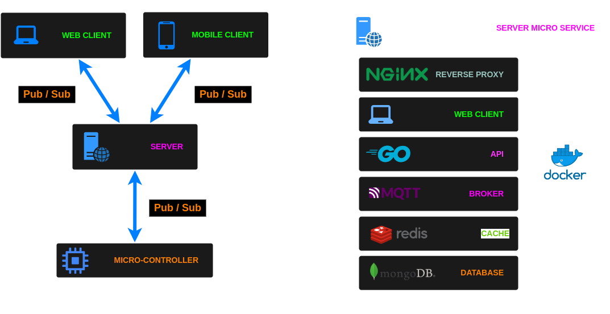

# Nidus

Nidus is a small experimental centralized home monitoring system that follow a
client/server architecture with multiple autonomous wireless devices.

> Nidus is an adverb of the Latin translation for `home`.

## Features

- Web GUI interface to manage devices (Sentinel)
- Monitoring:
	- Humidity
	- Temperature
	- Movement
	- Light
	- Gate
- Controlling
	- Monitoring sensors
	- Lights
	- Video camera
- Alerts & Notifications

## Software architecture

### Client

#### Web

NGINX Web server with a React application written in TypeScript.

See [Nidus Web Client](https://github.com/alexandrelamberty/nidus-web-client/) project.

#### Mobile

React Native application written in Typescript that allow you to configure Sentinel devices. 

See [Nidus Mobile Client](https://github.com/alexandrelamberty/nidus-mobile-client/) project.

### Server

The server application consist of 4 containerized services running on a
dedicated micro-computer.

See [Nidus Server](https://github.com/alexandrelamberty/nidus/server/) project.

- Web server - [NGINX]()
- API - [Golang]() & [Fiber]()
- Broker - [MQTT]()
- Database - [MongoDB]()
- Cache - [Redis]()

### Microcontroller

The micro-controllers I use are NodeMCU Amica V2 esp8266 esp-012F CP2120

They are based on `Sentinel` and they run a web server that expose an API to
interact with them and a MQTT client.

See [Sentinel](https://github.com/alexandrelamberty/sentinel/)

## References

